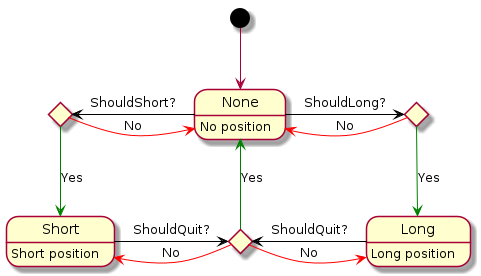

<h1> Setup </h1>
You'll need `BINANCE_API_KEY` and `BINANCE_SECRET_KEY` as env variable.

If you want to be nazi, you can gpg-encode them and use : 
```
. ./export_keys.sh
```
to export them as env variable.

Or you can just set them as env variable :boring: 

<h1> Bot's state Lifecycle</h1>

